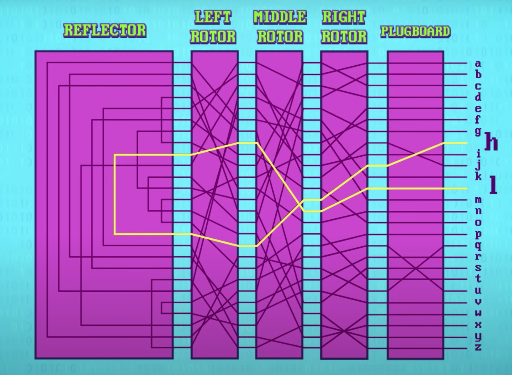
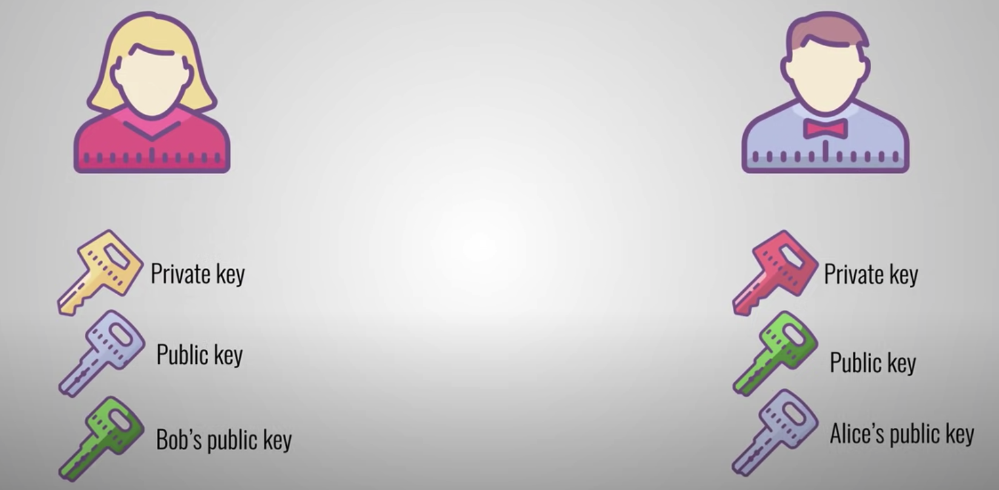
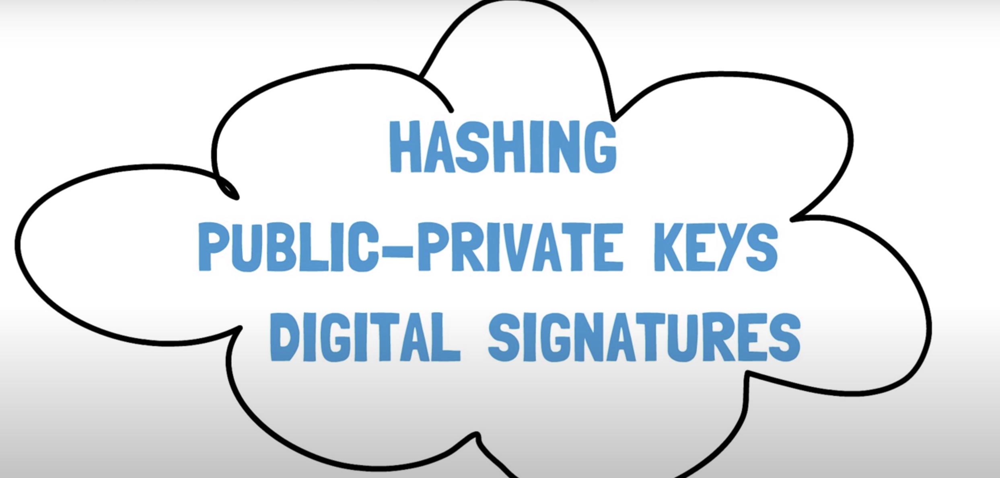

# Criptography

Is a method of developing techniques and protocols to prevent a third party form accessing and gaining knowledge of the data from the private messages during a communication process.

From Greek:

Kryptos ==>> Hidden

Graphein ==>> To write

 - Encryption: A process that converts PLAIN text into CIPHERTEXT
 - Encryption <<==>> Decription
 - Cipher: The mathematical function that is used to convert plaintext to ciphertext
 - Key: A small amount of information that is required to induce the output of the cryptographic algorithm
 - Ceaser Cipher (switch letter by 1)

The caesae cipher is one example of a larger class of techniques called Substitution Ciphers. 

These replace every letter ina  amessage with something else according to a translation.

- Permutation Cipher (grid where message is encrypted by reading it from top-down instead of left-right)

Columnar Transposition Cipher: It's a grid where the message is encrypted by reading it from top-down instead of left-right

- Enigma (Alan Turing)

It's consists in 3 encryption rotor followed by a reflector that goes back to the origin with the result.

The flow goes both ways so if A gives H then H gives A.

The encryption configuration can be modified so then the message changes with it.

From this point the encryption went from hardware to software.

- First cipher software was "Data Encryption Standard" developed by IBM and NSA in 1977.

DES used binary keys that were 56 bits long so there were 2^56 different keys

At that time no-one had enough computer power to find the key except the NSA but in 1999 a 250.000$ computer was able to try all the different keys in just 2 days rendering the DES insecure.

- 2001 Advanced Encryption Standard (AES)

It is designed to use bigger keys till 256 bits in size making brute force attack much harder.

For a 128-bit key you need trillions of years to try every combination even with today's computers.

AES chops data up to 16-byte blocks, and then applies a series of substitutions and permutatios, based on the key value, plus some other operations to obscure the message, and this process is repeated ten or more times for each block.

- Why only 128 bit keys and not much more? Why only 10 rounds?

It's a performance tradeoff. We need the perfect combination between high level of security and a relatively quick operation.

If it would take hours to encrypt an e-mail no-one would use it.

Today, AES is used everywhere, from encrypting files on iPhones and transmitting data over WiFi with WPA2, to accessing websites using HTTPS.

So far, the cryptographic techniques we’ve discussed rely on keys that are known by both sender and recipient.

The sender encrypts a message using a key, and the recipient decrypts it using the same key.

In the old days, keys would be shared by voice, or physically; for example, the Germans distributed codebooks with daily settings for their Enigma machines. But this strategy could never work in the internet era.

What’s needed is a way for a server to send a secret key over the public internet to a user wishing to connect securely.

It seems like that wouldn’t be secure, because if the key is sent in the open and intercepted by a hacker, couldn’t they use that to decrypt all communication between the two?

- Key Exchange

The solution is key exchange! An algorithm that lets two computers agree on a key without ever sending one.

- One-Way Function

We can do this with one-way functions – mathematical operations that are very easy to do in one direction, but hard to reverse.

- Diffie-Hellman Key Exchange

Diffie-Hellman key exchange is one method for establishing a shared key. These keys that can be used by both sender and receiver, to encrypt and decrypt messages, are called symmetric keys because the key is the same on both sides.

In Diffie-Hellman, the one-way function is modular exponentiation. This means taking one number, the base, to the power of another number, the exponent, and taking the remainder when dividing by a third number, the modulus.

So, for example, if we wanted to calculate 3 to the 5th power, modulo 31, we would calculate 3 to the 5th, which is 243, then take the remainder when divided by 31, which is 26.

But how does it work??

First, there's a set of public values – the base and the modulus, that, everyone gets to know. To send a message securely to John, I would pick a secret exponent: X. Then, I’d calculate B to the power of X, modulo M. I send this big number over to John.

John does the same, picking a secret exponent Y, and sending me B to the Y modulo M. To create a shared secret key, I take what John sent me, and take it to the power of X, my secret exponent.

This is mathematically equivalent to B to the XY modulus M.

John does the same, taking what I sent to him to the power of Y, and we both end up with the exact same number!

It’s a secret shared key, even though we never sent each other our secret number. We can use this big number as a shared key for encrypted communication, using something like AES for encryption.

The Caesar Cipher, Enigma and AES are all symmetric encryption.

- Asymmetric Encryption

There’s also asymmetric encryption, where there are two different keys, most often one that’s public and another that’s private.

So, people can encrypt a message using a public key that only the recipient, with their private key, can decrypt. In other words, knowing the public key only lets you encrypt, but not decrypt – it’s asymmetric!

The reverse is possible too: encrypting something with a private key that can be decrypted with a public key.
This is used for signing, where a server encrypts data using their private key.

This acts like an unforgeable signature, as only the owner, using their private key, can encrypt.

- RSA

The most popular asymmetric encryption technique used today is RSA, named after its inventors: Rivest, Shamir and Adleman.

When you connect to a secure website, like your bank, that little padlock icon means that your computer has used public key cryptography to verify the server, key exchange to establish a secret temporary key, and symmetric encryption to protect all the back-and-forth communication from prying eyes.

# Criptography Programming Concept

- Hash

sha256 or Argon2 (better solution)

- Salt

It's a random value added to the password before it is hashed therefore making it much harder to guess

- HMAC Hash-Based Message Authentication Code

It is an hash that also require a password defined by the original creator.

An example is a JSON web Token for authentication on the web.

When I generate a login in a trusted server it generates a token with its trusted key then the client can pass it back so the server can trust him.

- How to share a secret with someone and also allow them to read the original message

- Symmetric Encryption

- Asymmetric Encryption

You use it anytime you to a website https

The browser would automatically find a public key used to encrypt the data sent through the website. The data is then decrypted by the browser.

- Signing (Digital Signature)

Method of validation that secure that a data came from a trusted party.

# Criptography and Blockchain

Informations are stored in the Blockchain in Blocks as Lists.

These lists are linked using cryptography.

Blockchains mainly make use of two types of cryptographic algorithms asymmetric key algorithms and hash functions.

Hash functions are used to provide functionality of a single view of blockchain to every participant and generally blockchains use sha-256 hashing algorithm as their hash function

- Hash functions Benefits to the Blockchain

1) avalanche effect which simply means that a slight change in the data can result in significant different output 
2) uniqueness that is every input has a unique output
3) deterministic which means that any input will always have the same output if passed to the same hash function
4) quickness which means the output can be generated in a very small amount of time
5) reverse engine ring is not possible that is we cannot generate the input by having the output 
6) hash functions have a major role in linking the blocks to one another and also to maintain the integrity of the data stored inside each block any alteration in the blocked data can lead to inconsistency and break the blockchain making it invalid this requirement is achieved by property of hash functions called as avalanche effect 

- Asymmetric key

Asymmetric key cryptography is where the private key generally needs to be produced by a random number algorithm and the public key is calculated by executing an irreversible algorithm and that's why asymmetric encryption algorithm has an advantage of having separate public and private keys which can be transferred over unsecured channels easily.

Likely it also has several disadvantages some of which include low processing speed and unsatisfactory encryption strength also it is very much necessary to ensure the security of the asymmetric encryption algorithm during the transmission of data.

On the blockchain one of the major parts of asymmetric key cryptography is digital signatures which provides integrity to the process as they are easily verifiable and cannot be corrupted.

They also hold the quality of non-repudiation making them similar to signatures in the real world.

It is these virtual signatures which ensure that the blockchain is valid and the data is verified and correct.

Hashing, Public Private Key Pairs and Digital Signatures together constitute the foundation of blockchain technology.

These cryptographic features make it possible for blocks to get securely linked by other blocks and also ensure the reliability and immutability of the data stored on the blockchain.

- Application ==>> Cryptocurrencies

Cryptocurrencies are one of the major applications of blockchain and they use public private key pairs to maintain the addresses of users on the blockchain. 

For cryptography in blockchain the public key is used as the address of the person.

The public key is visible globally, it is visible to any participant while the private key is the secret key value and is used to access that address data and authorize any of the actions for the address which is generally regarded as transactions in the cryptocurrency language.

Digital signatures are widely used for cryptocurrencies as well they are used to approve the transactions by signing them securely and are also used for multi-signature contracts and digital wallets on the blockchain.

This helps to improve any action from these multi-signature contracts and digital wallets.

